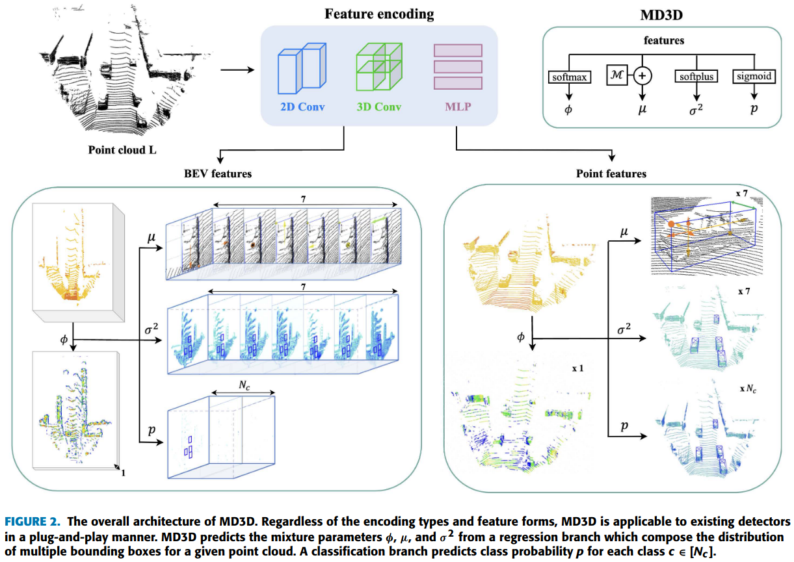
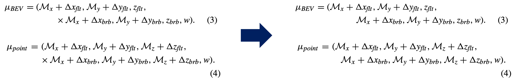

# MD3D: Mixture-Density-based 3D Object Detection in Point Clouds (IEEE Access)

This is the official implementation of [MD3D: Mixture-Density-based 3D Object Detection in Point Clouds](https://ieeexplore.ieee.org/document/9903612/) (IEEE Access).

<p align="center">
  
</p>

## Installation & Training
[README_OpenPCDet.md](README_OpenPCDet.md)

## Correction of typos
<p align="center">
  
</p>

## Citation
If you find this code useful in your research, please consider citing our work:
```
  @article{choi2022md3d,
      author={Choi, Jaeseok and Song, Yeji and Kim, Yerim and Yoo, Jaeyoung and Kwak, Nojun},
      journal={IEEE Access}, 
      title={MD3D: Mixture-Density-Based 3D Object Detection in Point Clouds}, 
      year={2022},
      volume={10},
      number={},
      pages={104011-104022},
      doi={10.1109/ACCESS.2022.3210108}
  }
```

## Acknowledgement
- This work is built upon the [OpenPCDet](https://github.com/open-mmlab/OpenPCDet), an open source toolbox for LiDAR-based 3D scene perception. Please refer to the official github repository for more information.
- Parts of our code refer to [MDOD](https://github.com/yoojy31/MDOD) and [CenterPoint](https://github.com/tianweiy/CenterPoint-KITTI).  